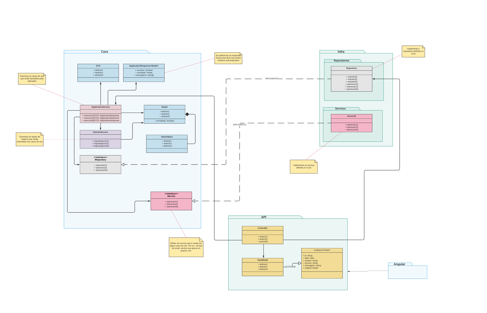

# Lab de Arquitetura - Core da Aplicação
Modelo de arquitetura para isolar as `regras de negócio` de uma aplicação.

## Application Services
Casos de usos

## Domain Services
Regras de negócio

## Model
Entidades do negócio

## Value Objects
Agregados

## DTO

## Builders
Ao invés de `criar instâncias de classes diretamente`, opte por usar métodos builders ou factories

## Interfaces
